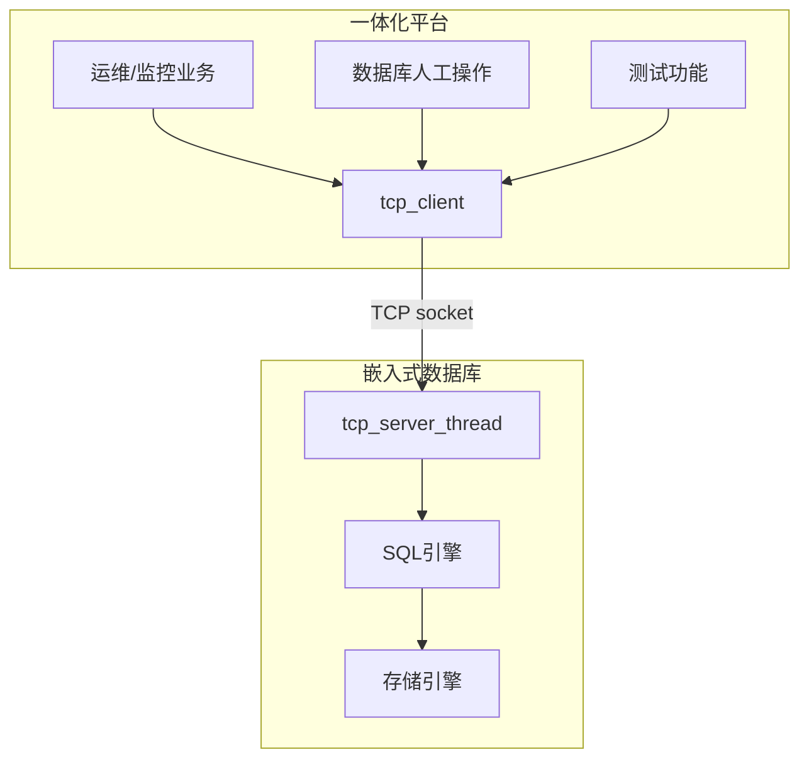
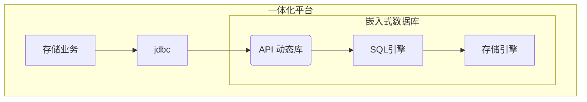
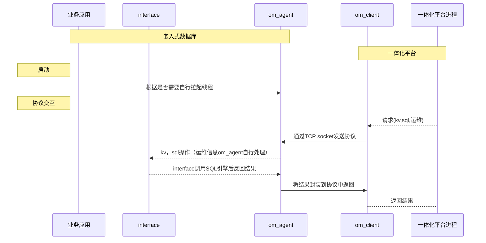
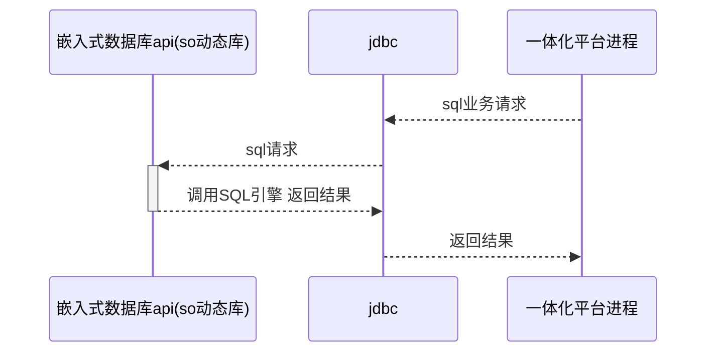

# 嵌入式数据库对接一体化平台方案

## 背景

### 项目背景

  * 为了方便嵌入式数据库运维，一体化平台需要支持对嵌入式数据库的运维管理。
  * 一体化平台需要数据库存储数据，而嵌入式数据库适用于此场景，使用嵌入式数据库替换原本的SQLite。对外而言展示了使用场景，也使嵌入式数据库的可靠性、可用性等方面有更强的说服力。对内在使用过程中可以给数据库提出一些建议和意见，帮助嵌入式数据库更加完善。

### 实现背景

  * 运维：目前嵌入式数据库没有开放端口，而一体化平台和数据库部署在不同机器，需要通过网络接入，因此需要嵌入式数据库实现监听服务来提供运维的接口。目前一体化平台常用的连接方式是websocket和http，而对于嵌入式数据库的设计应该尽量轻量化，因此本方案采用TCP连接方式。


  * 业务：嵌入式数据库本身设计用于此场景，实现jdbc调用嵌入式数据库的动态库即可。



## 功能

### 运维场景

一体化平台运维所需要的查询状态信息、运维操作等功能，以及供运维人员使用kv和sql的操作。

* kv: 建表,set,get,del。
* sql: 建表，curd, 建主键，建索引。
* 运维：cpu使用率，内存占用，磁盘占用，数据库管理等。

### 业务场景

一体化平台作为业务方使用嵌入式数据库存储数据，用嵌入式数据库替换SQLite， 一体化平台通过jdbc调用数据库的动态库进行操作。
* kv: 建表,set,get,del。
* sql: 建表，curd, 建主键，建索引，事务 等SQL引擎支持的都可以支持。

## 流程图

* 运维功能对接




* 业务功能




## 连接方式

TCP socket短链接。连接后没数据超时服务端会断掉连接，目前设置超时时间是500ms。

## 协议

协议字段用json,具体协议字段见[proto](proto.json)。

前四字节为json长度，拼在json之前。

### 字段说明

* protoId:协议Id，服务端根据不用ID调用不同的处理函数。见[srv_def.h](srv_def.h)。
* seqId:协议的唯一ID，之后考虑根据seqId（对整个协议hash）进行去重。
* rescode：返回执行结果，见[srv_def.h](srv_def.h)。

## 实现

### 数据库部分

#### 启动方式
提供一个额外扩展的库文件，供用户调用。该库不包含在数据库内核中。由用户方应用调用接口开启本服务。提供以下两种启动方式

  * 用户指定参数启动。

    代码样例
      ```c
        st_om_agent_config om_agent_config; /* 结构体包含字段：is_start_om_agent, om_agent_hosts,om_agent_port,db_path */
        init_om_agent_config(&om_agent_config, path); /*path 数据库路径*/
        strcpy(om_agent_config.om_agent_hosts[0], "127.0.0.0");/*指定数据库host*/
        if (srv_start_om_agent(&om_agent_config) != GS_SUCCESS ){
            printf("[om_agent failed\n");
        }
      ```
  * 用户指定配置文件启动。

    配置样例
    ```json
    {
      "is_start_om_agent":true,
      "om_agent_hosts":["127.0.0.0"],
      "om_agent_port":3333
    }
    ```
    代码样例

    ```c
    if (srv_start_om_agent_by_config("./om_agent_cfg.json", path) != GS_SUCCESS) { /*path 数据库路径*/
        printf("[API] om_agent failed");
    }
    ```


#### 监听线程

利用现成代码cs_listener.h，拉起监听线程，有连接时会调用srv_om_agent_connect_action函数进行处理，解析json获取protoId,然后调用不同处理函数进行处理。

#### 数据库操作

目前kv、sql都是自动commit, 后续考虑支持事务会在协议中增加sessionId、是否是事务的字段来进行标识。
